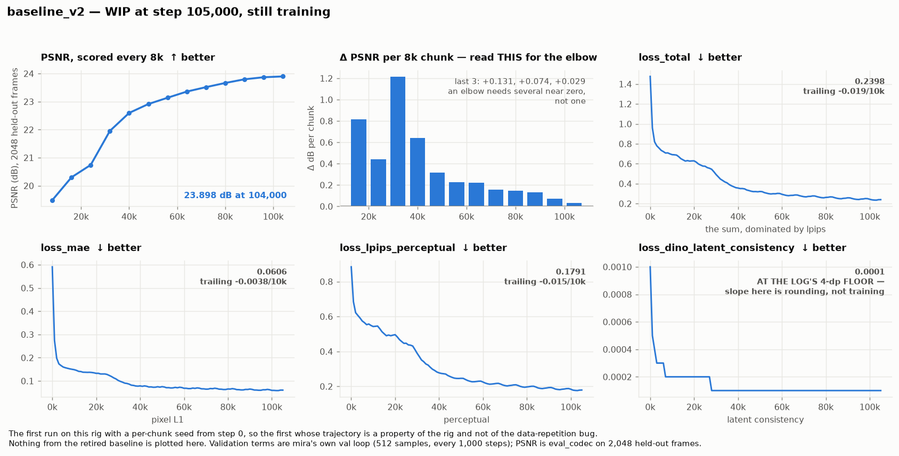

# Results — WIP, rebuilding on a clean baseline

**Status: almost nothing here yet, on purpose.**

On 2026-09-11 the baseline this project had been measuring against for a month was retired. Its
first seven chunks all ran a fixed `run.seed=28` — the data-repetition bug — so steps 0–56,000
replayed the same **53.4%** of the training data seven times and **46.6% of the dataset was never
seen**. Every absolute number derived from it is an artifact of that: its training speed, its
272,000-step elbow, its 24.747 dB plateau.

So the previous results page has been archived rather than patched:
[`archive/RESULTS-legacy-baseline.md`](archive/RESULTS-legacy-baseline.md). Its qualitative
findings survive and are worth reading; its numbers do not.

This page is being rebuilt from `baseline_v2`, and holds only what that run has actually produced.

**Every figure and number here is generated, not written.** Regenerate with:

```bash
pixi run python postprocessing/make_all.py
```

---

## 1. `baseline_v2` — the clean baseline, still training



The first run on this rig with a per-chunk seed from step 0, so the first whose trajectory is a
property of the rig rather than of the bug. Cold start, constant LR 1e-4 after a 1,000-step warmup,
hourly 8,000-step chunks, scored every chunk on 2,048 held-out frames, no anneal.

It is **still running**, so every number moves. Current values are in [`stats.md`](stats.md), whose
header carries its generation date; this prose stays qualitative on purpose, because prose that
hardcoded a running arm's frontier has gone stale twice in this project already.

### What the figure is for

- **The left pair is the elbow question.** Read the *increment* panel, not the curve. This project
  has twice called an elbow off a flat-looking curve and been wrong both times, and on both
  occasions the increment panel would have shown the flat stretch still buying ~0.1 dB a chunk. An
  elbow needs *several* trailing increments near zero.
- **The four loss panels are the ceiling question.** Each term gets its own scale because they
  differ by three orders of magnitude, and a shared axis would flatten three of them into a line.
  Each carries its own trailing slope, so "has this one stopped?" is answerable per term rather
  than by eye on `loss_total` — which is dominated by `loss_lpips_perceptual` and hides the rest.

### Two things to be careful about when reading it

- **`loss_dino_latent_consistency` has hit the log's 4-decimal-place floor.** It reads a flat
  `0.0001`, and that flatness is *rounding*, not convergence. Nothing can be concluded about that
  term's ceiling from this log; it would need either more decimals in mira's logging or a scored
  proxy. The panel says so rather than presenting the staircase as a curve.
- **The elbow is genuinely unknown, and may land later than the retired run's 272,000, not
  earlier.** A run seeing 100% of the training data has more to learn, not less. The early
  increments are encouraging, but "encouraging" is exactly what the two false plateaus looked like.

### What this run already settles

That the retirement was correct. At matched steps `baseline_v2` was **+1.87 dB** ahead of the
retired run by step 56,000 — a gap that accumulated almost entirely inside the replay window
(+1.797 dB over six chunks) and then nearly stopped growing (+0.196 dB over the next four) once the
old run finally got fresh data. That rate change is the signature of a cumulative coverage deficit
rather than ordinary seed variance. The full table is in
[`archive/RESULTS-legacy-baseline.md`](archive/RESULTS-legacy-baseline.md) and
[`../experiments/2026-09-10-paired-recalibration/NOTES.md`](../experiments/2026-09-10-paired-recalibration/NOTES.md).

---

## Not here yet

In the order they are queued — the plan of record and its costs are in
[`../AGENTS.md`](../AGENTS.md).

| | what it gives | status |
|---|---|---|
| `baseline_v2` elbow + anneal | a trustworthy fixed point; unblocks everything | **running** |
| `abl_frozen` | the frozen-bottleneck ablation, paired on data | queued |
| `baseline_v2_s2` | the seed spread, measured at the operating point | queued |
| `control` / `learned_mix` / `learn7` | Experiments 1 and 2, redone | queued |

Until the middle two land, this benchmark still has **no demonstration that it can resolve an
effect of the size it is asked to judge**. The original three-run calibration could not provide one
(one run per arm, all undertrained, unpaired, effect 1.27× the seed spread against a required 3×),
and it is not reported here.
