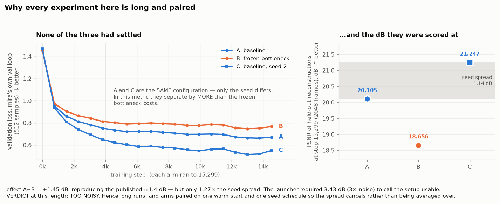
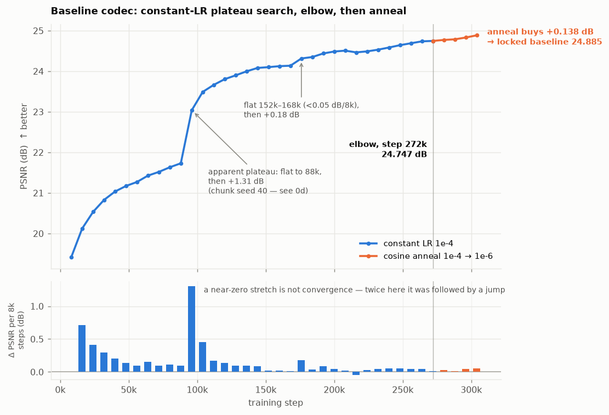
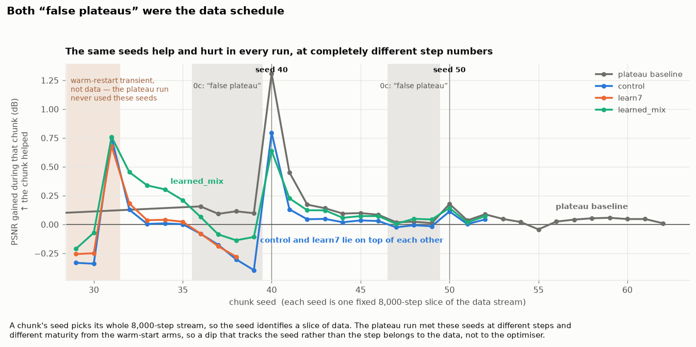
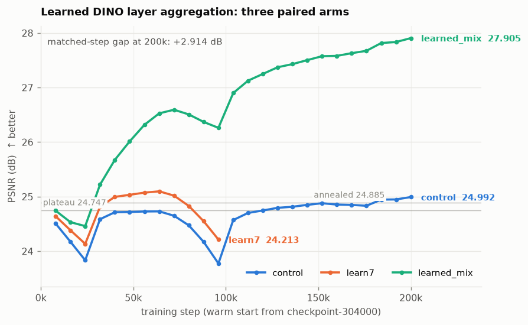
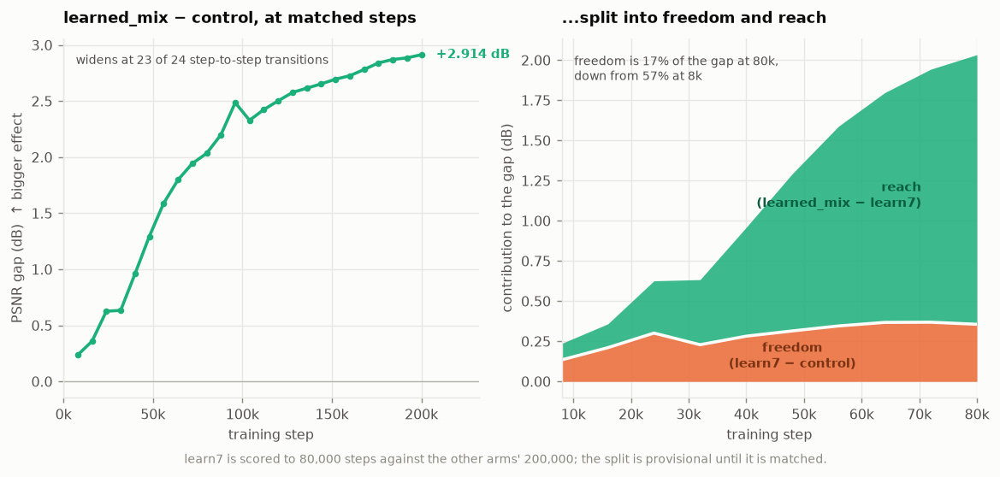
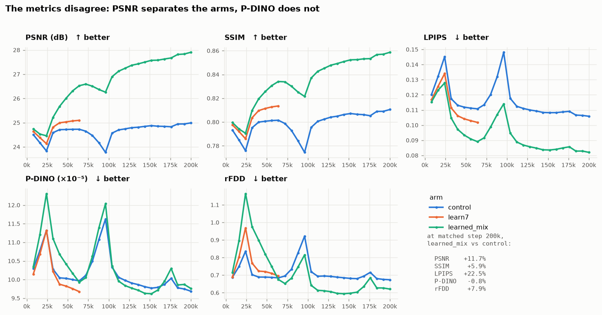
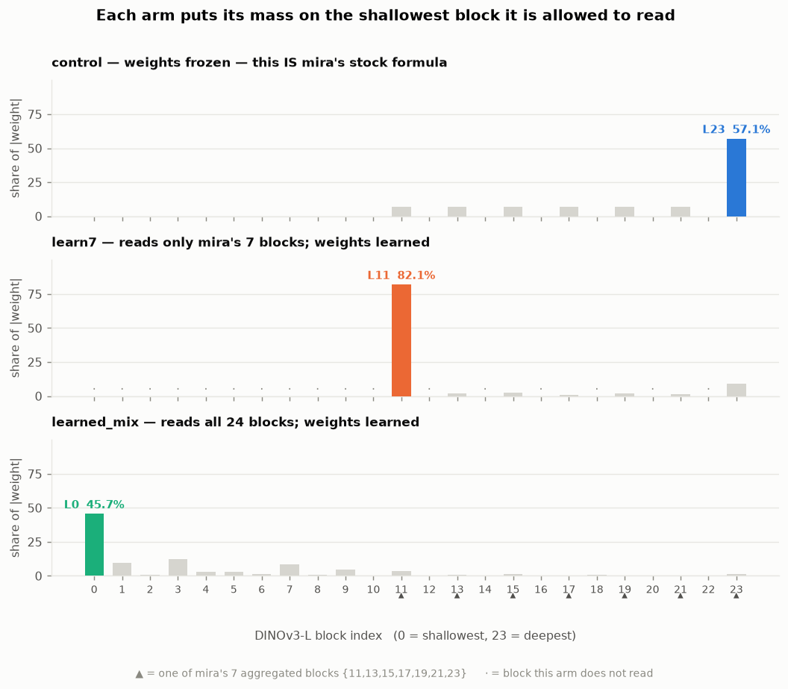
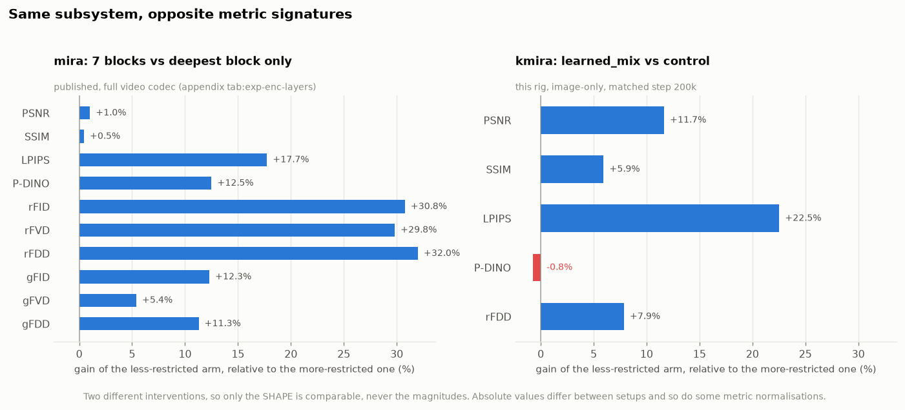

# Results, in pictures

The codec benchmark's numbers live in `codec/results/benchmark.jsonl`, one row per scored
checkpoint. That file is the record but it is not readable — this page is the readable version.

**Every figure and every number here is generated, not written.** The figures come from the
`plot_*.py` scripts beside this file; the numbers are quoted from
[`stats.md`](stats.md), which `make_all.py` regenerates from `benchmark.jsonl` and the committed
`data/*.json`. If a number here disagrees with `stats.md`, `stats.md` is right. Regenerate with:

```bash
pixi run python postprocessing/make_all.py
```

**`learn7` is still training**, so its numbers move between sessions. Anything about the frontier of
a running arm is therefore stated qualitatively here and quantitatively in
[`stats.md`](stats.md), whose header carries the date it was generated. Prose that hardcoded "at
64k, freedom is 20%" went stale twice inside a single afternoon; prose that says "freedom has
stopped growing while reach has not" stays true and points at the table for the number.

The page runs in dependency order: **the foundation** (how the benchmarked codec was built,
calibrated and trained — everything else is a comparison against its output), then results split
into **established** (paired, matched-step, complete) and **provisional** (arms still running, or
interpretation rather than measurement). That split is the point of the page.

---

## The foundation

Everything below this section is a *comparison against a fixed point*. This part is how that fixed
point was built and why it can be trusted.

The constraint behind every choice here is one 12GB consumer GPU. The scope was cut to match it —
smaller decoder, image-only, one dataset — so that what remained could be run properly rather than
run at all. A result from an experiment that fits its resources beats a bigger experiment that
does not.

### 0a. A deliberately smaller codec, scoped to one consumer GPU

mira's codec is a frozen DINOv3-L/16 feature extractor → a learned linear bottleneck → a ViT
decoder. This rig keeps that structure exactly and shrinks the parts that make it unaffordable on
one consumer GPU (RTX 4070 Ti, 12GB):

| | value |
|---|---|
| frame | 288×512×3 at 20 fps |
| timesteps per sample | **1 — image-only**, no temporal modelling |
| feature extractor | `dinov3_vitl16`, frozen |
| aggregated blocks | `[11, 13, 15, 17, 19, 21, 23]` (RAEv2's default, mira's choice) |
| latent | 32 channels on a 9×16 token grid |
| decoder used | **Base**: width 768, depth 12, heads 12 |
| decoder in mira's stock config | XL: width 1152, depth 28, heads 16 — 596,129,440 trainable |
| parameters | 417,342,496 total = **114,188,320 trainable** + 303,154,176 frozen (the backbone) |
| compression | 442,368 → 4,608 values per frame = **96×**, spatial only |
| optimiser | AdamW, lr 1e-4, betas [0.9, 0.95], weight decay 0.1 |

Everything shrunk here was shrunk to fit the scope to one consumer GPU. Two of those choices
change how the results downstream should be read.

**The Base decoder, not mira's XL.** Three reasons, in the order they mattered:

- **XL does not fit.** 596,129,440 trainable parameters against Base's 114,188,320; it OOMs on
  12GB under fp32 Adam.
- **Base is trainable to its elbow.** 272,000 steps, ~35h. XL at 5× the parameters would not have
  been, and a gap measured between two undertrained arms tells you which trains faster, not which
  is better.
- **The paper says Base is a reasonable codec.** It reaches 27.6 dB there, so this is a smaller
  configuration of mira's, not a degraded one.

Both are mira's own configs, so this is a config change and not a fork — training runs
`mira/scripts/train_codec.py` unmodified.

**Image-only.** `timesteps: 1` and no temporal stride, so the 96× compression here is purely
spatial where mira's 192× includes a 2× temporal reduction. This is the biggest single reason no
absolute number on this page is comparable with the paper's.

### 0b. The benchmark was calibrated before it was trusted — and it failed its own test



Before running any experiment: can this setup detect a bottleneck-sized change, and how big must a
gap be before it means anything? Three runs of 15,299 steps — a baseline (**A**), the same thing
with the bottleneck frozen at a random projection (**B**, a published ≈1.4 dB effect), and the
baseline again with a different seed (**C**, the noise floor).

What is plotted is mira's own validation loss, the per-step record these three arms kept, with each
arm's final dB reading in the legend beside the arm it belongs to. These were the first runs in the
project and they ran under the stock `checkpoint_keep_recent: 1`, so one checkpoint per arm
survived and the dB are endpoints rather than curves. Every run after this one keeps its
checkpoints and is scored densely — the plateau baseline has 34 PSNR readings, each warm-start arm
25 — so this is the only figure on the page without a dB curve, and both quantities agree here
anyway.

Colour follows the *configuration*, not the run: A and C are the same configuration, so they share
a hue and differ by marker. Two blue curves landing far apart, with the orange intervention
*between* them, is the finding.

- **The effect size reproduced.** A − B = **+1.4489 dB** against mira's published ≈1.4 dB (their
  table `tab:exp-bottleneck`: 29.7 learned vs 28.3 random frozen). The benchmark can see a
  bottleneck-sized change.
- **The comparison could not resolve it.** Two runs of the *identical* configuration, differing
  only in seed, came out **1.142 dB** apart. The launcher's own criterion for calling the setup
  usable was effect > 3 × noise = 3.426 dB. Ratio achieved: **1.27×**. Verdict: **TOO NOISY**.
- **The validation curves say the same thing independently, and slightly worse.** In loss the seed
  gap is *larger* than the intervention: |A−C| = 0.1205 against B−A = 0.0952. Two runs of one
  configuration differ by more than freezing the bottleneck costs.
- **All three had flattened, and the flatness meant nothing.** Each arm's trailing trend is an
  order of magnitude shallower than its opening one (A: −0.0078 loss per 1k steps over the last
  five readings against −0.0723 over the first half), so on the curve alone these look settled. But
  that residual slope is smaller than the reading-to-reading wobble in every arm — the last six
  readings span 0.037–0.050 — so the curve cannot tell you whether the descent has stopped, and all
  three ticked *up* at the final reading. What settles it is that the same baseline configuration,
  run long, sits in the same flat band (loss 0.6427–0.6988 over its own steps 9k–20k) and then runs
  to step **304,000**, ending at 0.2076: **39% of its entire descent** was still ahead of it, worth
  **4.762 dB** of PSNR. Flat at 15,000 steps is not converged at 15,000 steps.

**A tempting substitute that does not work.** The plateau run (0c) is the same baseline
configuration, cold-started and scored from step 8,000, and its reading at 16,000 (20.123 dB) sits
almost exactly on A's 20.105 at 15,299 — so it looks like a free third replicate of the baseline
seed. It is not comparable. The calibration arms ran a full cosine decay to 1e-6 across their
15,300 steps and therefore finished *annealed*, while the plateau run was mid-constant-LR at 1e-4.
Different schedules at the same step; the near-agreement is a coincidence, not evidence.

This is the most useful negative result in the project, and it is why the protocol looks the way it
does. Unpaired comparisons at short run lengths are worthless here. Everything after this uses
**long runs** and **paired arms warm-started from one checkpoint on an identical per-chunk seed
schedule**, so the seed spread cancels instead of being averaged over. That the paired arms later
traced the *same* dip-and-recovery shape (section 1) is the evidence that the cancellation works.

### 0c. Training the baseline to its elbow



The locked baseline is a constant-LR run taken to the point where it stopped improving, then
annealed. The top panel is scored PSNR; the bottom panel is the per-reading increment, which is
what makes "flat" falsifiable rather than a judgement call.

- Constant LR 1e-4 from step 8,000 to the elbow at **272,000** steps: 19.4139 → **24.7466 dB**.
- Cosine anneal 1e-4 → 1e-6 over 32,000 further steps: 24.7466 → **24.8850 dB**, a gain of
  **+0.138 dB**. That is `checkpoint-304000`, the locked baseline.

**Twice this run looked converged and was not.** The six readings from 48k to 88k averaged
**+0.116 dB** per 8k and never exceeded +0.157 — then it jumped **+1.31 dB** in a single 8k window
at 96,000. Later, steps 152k–168k each moved under 0.05 dB, three consecutive readings any
reasonable eye would call a plateau, and then it gained **+0.18 dB** at 176,000. Stopping at either
point would have locked in a baseline over a dB short, and every experiment since would have been
measured against it.

Both of those turned out to have a cause, which is the next section.

### 0d. Neither "false plateau" was a plateau — both were the data schedule



Training runs in hourly chunks of 8,000 steps, and each chunk resolves its own seed as
`28 + step/8000`. mira's train loader reseeds on every process start and is not checkpointed, so a
chunk's seed selects the entire 8,000-step stream that chunk trains on. **The seed is an identity
for a slice of data**, and the same seed means the same slice in every run on this schedule.

That makes the two flat stretches testable, because the plateau run and the warm-start arms met the
same seeds at different step numbers and at very different maturity. If a stretch belongs to
training dynamics it tracks the step; if it belongs to the data it tracks the seed. It tracks the
seed:

| chunk seed | plateau run | control | what 0c called it |
|---|---|---|---|
| 36–39 | +0.157 … +0.092 | −0.080 … −0.396 | first "false plateau" |
| **40** | **+1.308** | **+0.795** | the jump that ended it |
| 47–49 | +0.019 … +0.011 | −0.024 … −0.016 | second "false plateau" |
| **50** | **+0.178** | **+0.113** | the jump that ended it |

Seed 40's slice is the single best chunk of both runs. Seed 50's is the best chunk from seed 45
onward in **all three** runs that reached it (1/18, 1/8 and 1/8). Seeds 36–39 and 47–49 are the
worst in both — and the plateau run met them 100,000+ steps away from where the control did. Full
table in [`stats.md`](stats.md).

So the caution in 0c stands but its explanation was wrong: those were not the optimiser stalling
and breaking free, they were four poor data slices followed by a good one, twice. Two consequences:

- **An elbow judged on trailing readings is confounded by which seeds those readings landed on.**
  Comparing like seeds, or averaging over a run of them, is the sound version.
- **It is also why pairing works.** Since the slices are this uneven, an unpaired comparison
  measures the seeds as much as the intervention. The arms share the schedule exactly, so the
  unevenness lands on both and cancels — visible above as control and `learn7` lying on top of each
  other chunk for chunk.

One stretch is *not* evidence about data: the warm-start arms' first three chunks (seeds 29–31)
fall and rebound because a warm start resets the optimiser and raises the LR. The plateau run never
used those seeds, so there is no cross-run check, and the figure marks them separately.

**Why the anneal is a separate phase, and which number to compare against.** The +0.138 dB the
anneal buys is a property of the *low learning rate*, not of a better region of parameter space. A
warm start resets the optimiser and raises the LR again, handing that gain straight back. So a
constant-LR warm-started arm is read against the **24.747 plateau**, never the annealed 24.885 —
which is why both lines appear on every trajectory figure below.

### 0e. Supporting work with no figure

Recorded here for completeness because the results lean on it, but it produced fixes rather than
plottable data. Full detail in [`../CHANGELOG.md`](../CHANGELOG.md) and
[`../AGENTS.md`](../AGENTS.md).

- **A `[-1, 1]` vs `[0, 1]` pixel-range bug**, caught by scoring a flat gray image and finding it
  beat the real reconstructions. It silently zeroed every negative pixel. This is why the first
  thing the benchmark does with any new metric is check it against a trivial baseline.
- **Three hidden biases in eval sampling**, all found by measurement rather than inspection: the
  streaming loader stuck on 3 of 17 matches, unequal per-match weighting, and `max_clips` only ever
  sampling the opening minutes of each match. Every score on this page post-dates those fixes.
- **A data-repetition bug**: mira's train loader reseeds from `run.seed` on every process start and
  is not checkpointed, so chunked hourly training with a fixed seed replayed the identical stream
  every restart. It invalidated 56,000 steps of coverage before it was found. The per-chunk seed
  schedule that fixes it is also what makes the paired arms share data exactly.
- **No forked trainer.** Every divergence from mira is Hydra config or a small standalone patch
  module, so the baseline is a faithful reproduction of mira's own training path and not of a
  modified one.

---

## Established

### 1. Learning the DINO layer weights gains +2.914 dB over its paired control



Three arms, all warm-started from the same locked baseline (`checkpoint-304000`), same per-chunk
seed schedule, same 7-layer consistency loss. They differ only in which DINOv3 blocks the
aggregation reads and whether its weights can move.

At a matched 200,000 steps: **`learned_mix` 27.905 dB against `control` 24.992 dB**.

Quote that gap, not "+3.16 dB over the plateau". The control does not sit on the 24.747 plateau it
started from — it ends 0.245 above it, and above the annealed 24.885 too. The matched-step
arm-to-arm gap is the number this design supports.

Two things visible in the figure that are easy to miss in a table:

- **Both arms dip through 72k–96k and recover at 104k.** Those are chunk seeds 36–39 and 40, and
  section 0d shows the same seeds doing the same thing in the plateau run at a different point in
  training. The shape is the data schedule, not the intervention. It is why the control had to be
  run to full length: before it was, the variant's jump at 104k looked like it might be the idea.
- **The control keeps creeping up.** Constant LR was still buying roughly +0.03 dB per 8k steps out
  at 200k, so the plateau called at step 272,000 was a stopping point, not an asymptote.

### 2. The gap widens monotonically, and it is mostly *reach* rather than *freedom*



The gap grows from +0.236 dB at 8k to +2.914 dB at 200k, **widening at 23 of 24 step-to-step
transitions**. The one exception is 96k→104k, where the control climbed out of the shared dip a
reading before the variant.

The right panel splits it, which needs all three arms scored at the same step:

- **freedom** = `learn7 − control`: the weights are allowed to move, over mira's own 7 blocks
- **reach** = `learned_mix − learn7`: the other 17, mostly shallower, blocks become available

Freedom's **share of the gap falls at every single reading** — it starts as the majority of a very
small gap and is a minority of a large one by the time `learn7`'s frontier is reached. More
telling, freedom in absolute dB has now flattened while reach keeps climbing. The current values
are in [`stats.md`](stats.md)'s decomposition table; `learn7` is mid-run, so see the provisional
section below before quoting them.

### 3. The metrics disagree, and P-DINO does not separate the arms at all



At matched 200k, `learned_mix` over `control`: PSNR **+11.7%**, LPIPS **+22.5%**, SSIM **+5.9%**,
rFDD **+7.9%** — and P-DINO **−0.8%**, i.e. very slightly *worse*.

Look at the P-DINO panel: the two arms lie on top of each other for the whole run. The sign of the
difference flips six times, the gap is about 1% either way, and *within* either arm P-DINO swings
~20% following the shared dips. The metric is dominated by training phase, not by which arm you are
in.

Both arms do improve P-DINO against the plateau's `0.000100595` — but the control improves it
slightly more (`9.68847e-05` against `learned_mix`'s `9.76208e-05`), so none of that is
attributable to the aggregation. The claim was true against the plateau and false arm-to-arm.

So the +2.914 dB buys pixel fidelity, perceptual distance and distributional feature fidelity, and
buys **nothing measurable** on the benchmark's one paired DINOv3-feature perceptual distance. That
is an absence of gain, not a degradation.

### 4. Each arm puts its mass on the shallowest block it is allowed to read



This is the mechanism, and it is the most legible result here.

| arm | can read | largest block | share |
|---|---|---|---|
| `control` | all 24, weights frozen | **L23** — the deepest | 57.1% |
| `learn7` | blocks 11–23 only | **L11** — shallowest it can reach | 82.1% *(still moving)* |
| `learned_mix` | all 24 | **L0** — shallowest of all | 45.7% |

The top panel *is* mira's stock formula, drawn: the mean over seven blocks plus a residual on the
deepest, which puts 57.1% of the mass on L23. Each arm that is allowed to move its weights then
dumps mass on the shallowest block available to it, and abandons that deep residual —
`learned_mix` moves 92.4% of its mass onto the 17 blocks mira never reads, leaving 7.6% on mira's
seven.

Read shares, never raw magnitudes: the aggregation has an exact scaling symmetry with the
bottleneck projection, resolved arbitrarily by weight decay, so only the normalised direction is
identifiable. `learned_mix`'s raw weight vector collapsed from an init of L2 1.1952 to **0.0127**
while its PSNR climbed 3 dB (`learn7`: 0.0564), with the bottleneck projection absorbing the
scale. The collapse is that symmetry being resolved, not a signal.

### 5. The gain is concentrated in the metric least sensitive to layer choice



mira's own layer ablation (published, transcribed with provenance in
[`data/mira_layer_ablation.json`](data/mira_layer_ablation.json)) moves in the opposite shape.
Reading seven blocks instead of the deepest one alone gains them **+1.0% PSNR** and **+0.5% SSIM**
— but **+30.8% rFID, +29.8% rFVD, +32.0% rFDD**. The pixel and structural metrics are the two
*least* layer-sensitive things in their table, by 30–60× against the Fréchet distances.

Ours is the reverse: PSNR moves **most** (+11.7%) and the DINO-feature metrics lag (rFDD +7.9%,
P-DINO −0.8%).

Their generation metrics sit in between (gFID +12.3%, gFVD +5.4%, gFDD +11.3%) — so it is *not*
that downstream metrics are the sensitive ones. PSNR is simply the outlier.

Two comparisons of two different interventions, so only the **shape** transfers, never the
magnitudes — different setups, and some metric normalisations differ too (mira reports P-DINO
around 0.021 where this rig reports ~9.7e-05 for the same kind of quantity). What transfers is
that a gain concentrated in the least layer-sensitive metric is not what finding a better latent
looks like.

---

## Provisional

Real measurements, but not yet quotable as results.

### `learn7` is still running, and its numbers move

It is being trained toward the other arms' 200,000 steps and is not there yet, so **every number
involving `learn7` on this page is a snapshot** — check `stats.md`'s generation date. Two reasons
the split is provisional in both directions:

- `learned_mix` had banked well under two-thirds of its eventual +2.914 dB by the point `learn7`
  has reached, so this is the stretch of the curve that turned out least representative of the
  final answer.
- The shared 72k–96k dip sits right where `learn7` currently is, and both other arms lost ground
  through it before jumping at 104k. Reading `learn7` mid-dip would understate it.

Directionally the pre-registered hypothesis is holding: freedom's share of the gap falls at every
reading, and freedom in absolute dB has now stopped growing while reach has not. But the number to
report is the split at a matched 200,000, and that does not exist yet.

Its weight share is moving too — L11's share has climbed with every extraction, so the figure in
section 4 is a snapshot of a still-concentrating distribution, not a settled one.

### Nothing here tests the world model

The benchmark scores reconstruction only. Whether a layer-0-dominant latent serves the world model
that has to predict in it is untested, and there is a specific reason to expect trouble — see
`experiments/2026-08-13-learned-layer-mix/NOTES.md` for the argument, and
`experiments/2026-09-10-latent-predictability/NOTES.md` for the pre-registered experiment that
would measure the part of it reachable without a world model.

### The "regularizer" reading is an argument, not a measurement

The interpretation that mira's fixed layer set is a *regularizer* — encoding downstream knowledge
its reconstruction loss cannot express, so learning the weights removes a constraint rather than
tuning a hyperparameter — is consistent with everything on this page and with mira's own stated
methodology. It is not established by anything on this page. Experiment 4 is what would test it.

---

## Not comparable with the paper

Every absolute number here is within-setup only. This rig is image-only and reduced-scale on one
consumer GPU; its own faithful reproduction of mira's stock codec plateaus at 24.747 dB where the
paper's Base decoder reaches 27.6. So `learned_mix`'s 27.905 is **not** "past the paper's Base
decoder", and the figures above are never to be read against the paper's tables. The one place
published numbers appear is figure 5, where only the relative shape is used.
