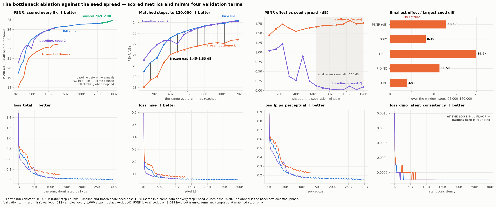

# A single-GPU reproduction of mira's video codec

**What this is.** [mira](https://github.com/kyutai-labs/mira) is a Rocket League world model. Its
perception front-end is a video codec — a frozen DINOv3-L/16 feature extractor, a learned linear
bottleneck, and a ViT decoder — and the world model predicts in the latent that codec produces.
This repository reproduces that codec at a scale that fits one consumer GPU, and uses it as a
benchmark for changes to the codec design.

**Status.** The benchmark, its training protocol and the reference baseline are done. The
calibration is also done: a frozen-bottleneck ablation plus a second-seed baseline show that the
benchmark resolves an effect of the size mira report (section 3). The layer-aggregation studies
are queued (section 4).

**Every figure and number here is generated from the run record, not written.** The numbers are
quoted from [`stats.md`](stats.md); if the two disagree, `stats.md` is right.

```bash
pixi run python postprocessing/make_all.py
```

---

## 1. The codec

mira's architecture is kept exactly; only the parts that make it unaffordable on one 12GB card are
reduced. Full configuration table in [`stats.md`](stats.md).

| | this rig | mira |
|---|---|---|
| feature extractor | `dinov3_vitl16`, frozen | same |
| aggregated blocks | `[11, 13, 15, 17, 19, 21, 23]` | same (RAEv2's k=7 default) |
| decoder | Base — 768 wide, 12 deep | XL — 1152 wide, 28 deep |
| trainable parameters | 114,188,320 | 596,129,440 |
| frame | 288×512, 20 fps | same |
| timesteps per sample | 1 (image-only) | 40 |
| compression | 96×, spatial only | 192×, spatial + 2× temporal |

Two reductions matter for reading anything below.

**The Base decoder.** XL does not fit in 12GB under fp32 Adam. Base is one of the three sizes mira
themselves ablate, so it is a published operating point rather than an arbitrary shrink, and it is
the only size cheap enough to train deep into diminishing returns here — which matters more than
absolute quality, because a gap measured between two undertrained models tells you which trains
faster, not which is better. Both are mira's own configs, so this is a config change and not a fork: training runs
`mira/scripts/train_codec.py` unmodified.

**Image-only.** `timesteps: 1`, no temporal stride. This is the single biggest reason no absolute
number here is comparable with mira's published values.

## 2. Protocol

**Metrics.** Every checkpoint is scored on 2,048 held-out frames with a fixed evaluation seed:
PSNR, SSIM, LPIPS, P-DINO (paired DINOv3-B feature distance) and rFDD (reconstruction Fréchet DINO
distance). Training additionally logs mira's own validation loss — four terms, every 1,000 steps,
on a separate 512-sample split.

**Runs are chunked and scored inline.** Training advances in 8,000-step chunks; each chunk ends in
a checkpoint, a validation reading and a scoring pass. A run is therefore a curve rather than an
endpoint, and can be stopped and resumed on any chunk boundary because the learning rate is held
constant.

**The recipe is locked** — constant LR 1e-4, 8,000-step chunks, and a data seed fixed by the
absolute step. Every arm runs it and is read at matched steps. Pre-registered in
[`experiments/2026-09-10-paired-recalibration/NOTES.md`](../experiments/2026-09-10-paired-recalibration/NOTES.md).

**Runs stop on a step budget.** Constant LR here has never produced a detectable plateau, so the
length is a decision rather than a measurement. Consecutive chunks train on different data, so
progress is read as a trailing trend, never off a single chunk.

## 3. Calibration: can the benchmark resolve a known effect?



**Design.** Three runs under the locked recipe. mira report that freezing the linear bottleneck
at its random initialisation costs about **1.4 dB**. That change removes 131,104 of 114,188,320
trainable parameters (0.115%).

| run | model | seed base | role |
|---|---|---|---|
| baseline (`baseline_v2`) | stock | 1028 | reference |
| frozen bottleneck (`abl_frozen`) | bottleneck projection not trained | 1028 | ablation, paired with the baseline |
| baseline, seed 2 (`baseline_v2_s2`) | stock | 2028 | run-to-run spread |

Because the seed base is shared, the baseline and the frozen arm start from identical weights and
train on identical data at every step. The only difference is whether the bottleneck receives
gradients. Two checks confirm this: both runs log the same step-0 training loss (**0.9890**;
seed 2 logs **1.2022**), and they share all **17** chunk seeds. The seed-2 run differs from the
baseline in both initialisation and data, so the difference between those two runs measures
run-to-run spread.

**Baseline.** It ran at constant LR to 264,000 steps and reached **24.6624 dB**. It was still
improving at **+0.019 dB per 10,000 steps**, 13× the spread between readings, so it was stopped on
budget rather than at a ceiling. A 32,000-step cosine decay then took it to **24.9122 dB** at step
296,000 (**+0.2498 dB**). The comparisons below use only the constant-LR readings, at matched
steps.

**Result 1: the ablation costs 1.45–1.83 dB.** Over 16 matched readings to step 128,000, the
frozen arm is below the baseline at every step, by **1.4470** to **1.8283 dB**. The gap had not
settled when the run stopped: over the last 8 readings it grew by **+0.015 dB per 10,000 steps**.
The size is consistent with mira's ~1.4 dB but not equal to it; this rig uses a smaller decoder
and trains on images only (section 1).

**Result 2: after about 60,000 steps, the gap is much larger than the seed spread.** The two
seeds differ by **up to 1.22 dB** over the first 56,000 steps, which is nearly the size of the
effect. From 64,000 to 120,000 steps (8 readings), they differ by **at most 0.13 dB**.

| metric | smallest gap, 64k–120k | largest seed difference, 64k–120k | ratio | ratio, all steps |
|---|---|---|---|---|
| PSNR (dB) | 1.67 | 0.128 | **13.1×** | 1.2× |
| LPIPS | 0.0747 | 0.00375 | **19.9×** | 1.5× |
| P-DINO | 5.67e-05 | 4.94e-06 | **11.5×** | 2.5× |
| SSIM | 0.0558 | 0.00673 | **8.3×** | 1.4× |
| rFDD | 0.576 | 0.147 | **3.9×** | 1.4× |

In that window, all five metrics clear the 3× criterion set for the original calibration; rFDD
clears it by the least. Over all steps, none of them does. That matches the failure of the earlier
three-run calibration, which was read at 15,299 steps. **Comparisons on this rig are therefore only
meaningful after about 64,000 steps.** Of mira's validation terms, `loss_mae` and
`loss_lpips_perceptual` separate the arms. `loss_dino_latent_consistency` is at the log's
four-decimal floor, so it cannot be read.

**Result 3: the dip at step 104,000 came from that chunk's data, not from the step.** Between
96,000 and 104,000 the baseline gained only **+0.029 dB**, while seed 2, on different data, gained
**+0.128 dB**. Seed 2 has its own dip on a different chunk: **−0.318 dB** at 48,000. Single-chunk
dips therefore reflect the data slice, which is why progress is read as a trend (section 2).

**Limits.**
- The spread comes from **one pair of seeds**. It shows how large run-to-run differences can be,
  not their distribution.
- The window was chosen after seeing the data. The per-step table in [`stats.md`](stats.md) gives
  every reading.
- All readings are at constant LR. The arms were not annealed, so the gap after an anneal is not
  measured.

## 4. In progress

Queued under the same recipe: the learned layer-aggregation studies (`control`, `learned_mix`,
`learn7`), read at matched steps past 64,000. Earlier studies that ran against a superseded
baseline are archived at [`archive/RESULTS-legacy-baseline.md`](archive/RESULTS-legacy-baseline.md);
their magnitudes do not carry over, and nothing here depends on them.
